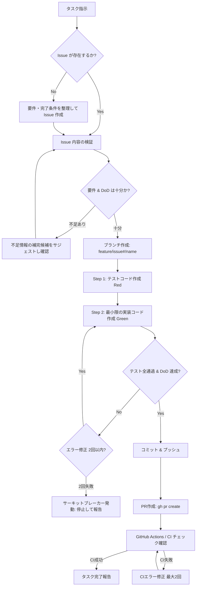

# Antigravity (agy) / Codex / Claude Code グローバル設定 & 開発ワークフロー 構築サマリー

本ドキュメントは、Antigravity (agy)、Codex、Claude Code のグローバル設定（ルール、サーキットブレーカー、標準スキル）の構築経緯および構成内容をまとめたものです。
新規セッション開始時やディレクトリ移動後も、本ファイルを参照することで前回の設計思想と設定状況を即座に把握・再開できます。

設定の原本はこのリポジトリで Git 管理し、ホーム以下にはコピーを配布します。
ホーム側を直接編集せず、原本の編集後に `python3 scripts/deploy.py --apply` を実行してください。
`python3 scripts/deploy.py` は差分確認だけを行い、差分があれば終了コード 1 を返します。
変更前のファイル・リンク・管理対象スキルディレクトリは、`~/.agent-shell-setting-backups/deploy-*/` に退避します。
復旧時は表示されたバックアップ内の対応する項目を元の場所へ戻してください。旧リンク先も同じ配布で変更した場合は、その原本も一緒に戻します。

管理対象は `rules/AGENTS.md`、`skills/`、`claude-code/settings.json`、`claude-code/hooks/circuit-breaker.py` です。
認証情報、会話ログ、キャッシュ、サーキットブレーカーの実行状態、今回扱っていない個別設定は取り込みません。
Claude の settings は確認済みの既存設定全体（theme・enabledPlugins を含む）を原本とし、配布時に全体をコピーします。
現在の hook コマンドには `/Users/sugita` の絶対パスが含まれるため、別ユーザー環境では原本のパスを調整してください。

---

## 1. 構築の背景と最重要方針

エージェント開発において最も懸念される **「同一エラーの無限試行による泥沼ループ」および「トークンの大量浪費」を防止すること** を最優先課題とし、グローバルルールと作業手順（スキル）を設計しました。

### コア設計思想
- **指示の軽量化**: ユーザーは「要件と完了条件 (DoD)」を2〜3行で指示するだけで、定型ルール（ブランチ命名、TDD、PR作成等）はエージェントが自動準拠する。
- **サーキットブレーカー**: 試行上限を厳格に「2回」と定め、迷走する前に自律停止して人間に指示を仰ぐ。

---

## 2. グローバル設定ファイル一覧

| ファイル / ディレクトリ | 役割・内容 |
| :--- | :--- |
| [`~/.gemini/ANTIGRAVITY.md`](file:///Users/sugita/.gemini/ANTIGRAVITY.md) | **全プロジェクト共通の行動規範・安全弁**<br>・サーキットブレーカー（同一エラー修正上限2回）<br>・ディレクトリ内外の実行権限・確認ルール<br>・日本語応答、謝罪抑制、呼称（私/あなた） |
| [`~/.gemini/old-GEMINI.md`](file:///Users/sugita/.gemini/old-GEMINI.md) | 旧 `GEMINI.md` のバックアップ（参照無効化済み） |
| [`~/.gemini/antigravity-cli/skills/github-tdd-workflow/`](file:///Users/sugita/.gemini/antigravity-cli/skills/github-tdd-workflow/) | **標準開発ワークフロースキル**<br>Issue駆動、Git Flow、TDD、PR作成・CI修正の統合手順書 |
| [`~/.gemini/config/skills/github-tdd-workflow/`](file:///Users/sugita/.gemini/config/skills/github-tdd-workflow/) | 上記スキルの同期配置 |
| [`~/.codex/AGENTS.md`](file:///Users/sugita/.codex/AGENTS.md) | Codex のグローバル指示。`rules/AGENTS.md` のコピー。 |
| [`~/.agents/skills/github-tdd-workflow/`](file:///Users/sugita/.agents/skills/github-tdd-workflow/) | Codex のグローバルスキル。`skills/github-tdd-workflow/` のコピー。 |
| [`~/.claude/CLAUDE.md`](file:///Users/sugita/.claude/CLAUDE.md) | Claude Code の個人共通指示。`rules/AGENTS.md` のコピー。 |
| [`~/.claude/skills/github-tdd-workflow/`](file:///Users/sugita/.claude/skills/github-tdd-workflow/) | Claude Code の個人共通スキル。`skills/github-tdd-workflow/` のコピー。 |
| [`~/.claude/settings.json`](file:///Users/sugita/.claude/settings.json) | Claude Code のグローバル hooks 設定。サーキットブレーカーを実行時に強制する。 |
| [`~/.claude/hooks/circuit-breaker.py`](file:///Users/sugita/.claude/hooks/circuit-breaker.py) | Bash・Edit・Write の同一エラーをセッション単位で数え、2回で以降の変更・実行を停止する hook 本体。 |

---

## 3. 定義されたルールの詳細 (`~/.gemini/ANTIGRAVITY.md`)

### ① サーキットブレーカー（無限ループ・トークン浪費防止）
* **同一エラーの修正試行は最大2回まで**。
* 2回連続で失敗した場合、**3回目の修正を勝手に試みることを厳禁とし、即座に作業を停止**。
* **停止時の報告フォーマット**:
  1. 発生している具体的なエラー / 現象（ログ・スタックトレース要約）
  2. これまでに試した2回のアプローチとそれぞれの結果
  3. 考えられる根本原因の仮説と、取りうる今後の選択肢
* **ロールバックファースト**: 失敗した修正はクリーンに戻し、パッチの上にパッチを重ねない。
* **トークン節約**: コマンド出力ログは `grep` / `head` / `tail` で行数を絞る。

### ② トークン・コンテキストの予算管理
長時間セッションでは、同じ資料の再読込や広すぎるログの確認が入力トークンを急増させるため、次の制約を共通ルールとします。

* 作業開始時に目的・対象・完了条件を短く定め、不要な探索や説明を省く。
* ファイルとログは必要箇所だけ読み、既読内容は要約して再利用する。同じ確認を根拠なく繰り返さない。
* 独立した確認はまとめて実行し、待機・ポーリングには上限を設ける。
* サブエージェント、外部ハーネス、大規模調査は小さな作業では使わず、効果が明確な場合に限る。
* コンテキスト使用率が 60% を超えたら探索範囲を狭め、70% を超えたら広範な探索・委任を止めて、現状と残作業を要約する。
* 長い出力は全文を会話へ渡さず、失敗箇所や必要な先頭・末尾だけを抽出する。
* 各操作の目的を確認し、結果に結びつかない操作は実行しない。

### ③ 実行権限・確認ルール
* **カレントディレクトリ以下**: 非破壊的操作（作成、編集、閲覧、テスト実行等）は **事前確認不要**。破壊的操作（ハードリセット、重要ディレクトリ削除等）は要確認。
* **カレントディレクトリ外**: ファイル操作・コマンド実行は **すべて事前確認が必要**。
* **サンドボックス環境**: ネットワーク通信を除き、**すべて事前確認不要**。

### ④ コミュニケーション方針
* **言語**: 例外なく日本語で回答（英語指示に対しても日本語応答）。
* **呼称・トーン**: 一人称「私」、二人称「あなた」。親しい同僚のように適度にフランクかつプロフェッショナル。
* **謝罪抑制**: 謝罪は簡潔に1回のみ。繰り返さず問題解決を最優先する。
* **不確実性の早期確認**: 前提やエビデンスが曖昧な場合は当てずっぽうに進めず、ユーザーに確認する。

---

## 4. グローバルスキル (`github-tdd-workflow`) の詳細

タスク指示を受けた際にエージェントが自律的に適用する4段階のワークフローです。



1. **Step 1: チケット駆動（Issue）**
   - 既存Issueを確認。ない場合は要件・完了条件（DoD）を整理して作成。
   - 要件やDoDが不足している場合は、勝手に進めず **補完候補をサジェスト** してユーザーの合意を得る。
2. **Step 2: Git Flow ブランチ管理**
   - スタートポイント: **原則として `develop`**（依存する先行未マージブランチがある場合は検索して特定）。
   - ブランチ命名規則: `feature/{issue#}/{short-description}`
3. **Step 3: テスト駆動開発 (TDD)**
   - テスト先行作成（Red確認）→ 最小限の実装（Green確認）。
   - **テストコード保護**: テストが通らないからといってテスト期待値を勝手に緩和・修正することは厳禁。
4. **Step 4: PR作成 & CI修正**
   - Conventional Commits 規約準拠でコミットし、`gh pr create`（`Closes #{issue#}` を明記）。
   - PR作成後の GitHub Actions（CI）エラーもタスク範囲として自動修正（上限2回）。

---

## 5. 次回セッション以降の検討・拡張候補

個別プロジェクトの進行に合わせて、必要に応じて以下を順次整備していく方針です：
1. **プロジェクト固有の `AGENTS.md` テンプレート作成**
2. **コードベース探索・リポジトリ調査スキル**
3. **MCPサーバー連携やツール固有設定**

---

## 6. Codex / Claude Code との共有方法

以前のホーム間シンボリックリンクを通常のコピーに変更し、全ハーネスの原本をこのリポジトリに集約します。
配布スクリプトは次の対応でコピーします。無関係なスキルや設定には触れません。

```text
rules/AGENTS.md
  => ~/.gemini/ANTIGRAVITY.md
  => ~/.codex/AGENTS.md
  => ~/.claude/CLAUDE.md

skills/<skill-name>/
  => ~/.gemini/antigravity-cli/skills/<skill-name>/
  => ~/.gemini/config/skills/<skill-name>/
  => ~/.agents/skills/<skill-name>/
  => ~/.claude/skills/<skill-name>/

claude-code/settings.json => ~/.claude/settings.json
claude-code/hooks/circuit-breaker.py => ~/.claude/hooks/circuit-breaker.py
```

共通ルール・スキルを変更する際はリポジトリの原本を編集し、差分をレビューしてから配布します。
配布後は差分確認を再実行し、`0 target(s) differ` を確認してください。
スキルディレクトリは全体を退避・コピーするため、配布先だけに加えた編集は次の配布で置き換わります。
原本からスキルを削除しても、ホーム側のスキルは自動削除しません。

---

## 7. Claude Code のサーキットブレーカー強制

`~/.claude/settings.json` のグローバル hooks で、`CLAUDE.md` の「同一エラーの修正試行は最大2回」のルールを強制する。

1. `PostToolUseFailure` が Bash・Edit・Write の失敗を記録し、エラー内容を正規化して同一性を判定する。
2. 同一エラーが2回発生すると、同一セッション内の `Bash`、`Edit`、`Write` を `PreToolUse` が拒否する。
3. `Read` は拒否しないため、根本原因の調査と停止報告は継続できる。
4. ユーザーが「サーキットブレーカー解除」または `circuit breaker reset` と明示すると、`UserPromptSubmit` hook がそのセッションの停止状態を解除する。

hook のソースは [`claude-code/hooks/circuit-breaker.py`](claude-code/hooks/circuit-breaker.py) に保管し、実行用のコピーを `~/.claude/hooks/` に配置する。スクリプトを更新した場合は実行用コピーも同期する。

## 8. 4役の開発スキル

| スキル原本 | 担当 |
| --- | --- |
| [orchestrator](skills/orchestrator/SKILL.md) | 唯一の親。委任・ブランチ・コミット・push・PR・CI・停止と再開を管理 |
| [planner](skills/planner/SKILL.md) | Issue の作成・確認、要件・DoD・coder の実装計画 |
| [coder](skills/coder/SKILL.md) | 承認済み計画に従った TDD（Red → Green）と実装 |
| [reviewer](skills/reviewer/SKILL.md) | 計画・実装をレビューし approved / changes_requested / blocked を返す |

これらは Codex・Claude Code・agy のスキル配置先へ同じ内容でコピーする。
既存の github-tdd-workflow は単独実行用として残し、役割が指定された場合は担当工程だけを適用する。

```text
親 → planner → reviewer(plan) → coder → reviewer(implementation)
    → 親が commit / push / PR → CI → 完了
```

指摘があれば担当へ戻す。CI 失敗が仕様・設計に関わる場合は planner、実装・テスト・ビルドの不備なら coder に戻す。
修正後は再レビューし、最新 PR head の CI 成功を確認する。環境障害・権限不足には根拠なくコード変更を行わない。
親も子もハーネスは固定しない。既定は planner=claude、coder=codex、reviewer=agy で、依頼時に上書きできる。

親への依頼例:

> orchestrator スキルで Issue #123 を進めて。planner=claude、coder=codex、reviewer=agy。

親が子を呼ぶ際には、担当スキル、Issue、計画版、作業範囲、成果物の返却先を渡す。
状態と引き継ぎの形式は [handoff.md](skills/orchestrator/references/handoff.md) を参照。

呼び出し方式は既定で `auto` とし、同一ハーネスで利用可能な場合は標準サブエージェント（native）、別ハーネスや独立した設定が必要な場合は外部呼び出し（external）を使う。
親セッションの公開ツールで利用可否を確認し、[select_route.py](skills/orchestrator/scripts/select_route.py) で選択する。
このツールは方式を決めるだけで、エージェントの起動や能力の自動検出は行わない。
利用不能時のフォールバックも同じ対象ハーネスに限り、旧子の停止を確認するまで再起動しない。
詳しい選択条件は [routing.md](skills/orchestrator/references/routing.md) に記載。

### 実装済みの範囲と次の接続作業

スキル・共有ルール・方式選択ツール・外部CLIランナー・配布は実装済み。
外部実行は [external_runner.py](skills/orchestrator/scripts/external_runner.py) の run / status / cancel を使う。
起動方法、結果の読み方、権限、停止の制約は [external-runner.md](skills/orchestrator/references/external-runner.md) を参照。
同じタスクの外部起動は排他し、親が blocked の場合や未解決の旧ジョブがある場合は起動を拒否する。
親の単一起動ロック、native と external をまたぐ排他、修正回数の自動判定・強制は未実装。
現時点の横断的な停止・回数引き継ぎはスキルの指示であり、Claude の既存 hook は従来どおりセッション単位で動作する。
既存 hook は意図した TDD Red でもツール失敗なら記録するため、実運用前に TDD と停止判定の整合性を検証する必要がある。
2026-09-10 の接続確認結果:

| 接続 | 結果 |
| --- | --- |
| 現在の Codex セッション → 標準サブエージェント | 起動・結果返却・追加依頼を確認。実装レビューにも使用 |
| 外部 Codex CLI | 担当 skill を渡し、`approved / HARNESS_SMOKE_OK` を取得 |
| 外部 agy CLI | request.md を読んで `approved / HARNESS_SMOKE_OK` を取得 |
| 外部 Claude CLI | 未契約のため、ユーザー指定で実機検証を保留 |

`tests/fixtures/smoke-request.md` は変更操作なしの計画レビュー用の入力。
CLI ランナーの正常系・JSONエラー・空回答・タイムアウト・取消・排他・終了時競合は偽CLIによる自動テストで検証している。
実行ログは `.orchestration/` に保存し、Git 対象外とする。
別の ACP アダプタ／起動環境での標準サブエージェント利用可否、および3ハーネスでの実装→PR→CIの一連の実運用は未検証。
2026-09-11: agy を標準入力・出力の stream-json に変更。取消後、同じ会話IDの `ERROR / interrupted` と CLI 終了を強制停止なしで確認した。
これはハーネスの終了応答の確認であり、外部サービス内部の全処理停止の保証ではない。終端結果がない場合や強制停止が必要な場合は unknown として再起動を拒否する。
実機取消検証は `python3 tests/probe_agy_cancel.py --task-id <未使用ID>` で実行できる（agy の認証・通信が必要）。

この設定リポジトリにはリモートがないため、今回のスキル作成はローカルブランチで管理し、Issue・PR・CI は作成・実行していない。
