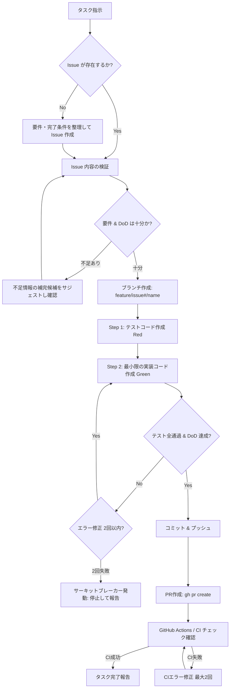

# GitHub TDD Workflow

機能開発・バグ修正・コード実装タスクを遂行する際の標準ワークフローです。
すべてのタスクは「Issue駆動」「Git Flow」「テスト駆動（TDD）」に則って進めます。

## 役割を分担する場合

orchestrator / planner / coder / reviewer として呼ばれた場合、この文書は工程全体の参照とし、実行範囲は割り当てられた役割に限定する。
planner は Issue と計画、coder は TDD 実装、reviewer は計画・実装レビュー、orchestrator は進行・ブランチ・コミット・push・PR・CI を担当する。
子は他の子を起動せず、全工程を独自に実行しない。仕様・DoD の変更判断は親を通してユーザーに確認する。
単独作業では従来どおり以下の全工程を使う。

---

## ワークフローの全体フロー

---

## Step 1: Issue の確認・作成（チケット駆動）

1. **既存 Issue の確認**:
   - `gh issue list` や `gh issue view <issue#>` で該当する Issue を確認する。
2. **Issue が存在しない場合**:
   - ユーザーの要望から「要件」と「完了条件 (Definition of Done: DoD)」を抽出して Issue を新規作成する。
   - コマンド例: `gh issue create --title "<タイトル>" --body "<内容>"`
3. **要件 & DoD のバリデーション**:
   - Issue に以下の要素が明確に含まれているか確認する：
     - **背景・目的**
     - **具体的な要件（仕様）**
     - **完了条件 (DoD)**（どのようなテストが通り、どのような挙動になれば完了か）
   - **不足・曖昧な場合**:
     - 勝手に実装へ進まない。
     - **不足している情報の補完候補（サジェスト）** を提示し、ユーザーの合意を得た上で Issue を更新する。

---

## Step 2: ブランチ作成（Git Flow）

1. **スタートポイントの選定**:
   - **原則として `develop` ブランチ** をスタートポイントとする。
   - 他の未マージブランチ（先行する別 feature ブランチなど）に依存する場合は、`git branch -a` や `gh pr list` で検索・特定し、そのブランチをスタートポイントとする。
   - `develop` が存在しない初期状態の場合は、デフォルトブランチ（`main` 等）を確認する。
2. **ブランチ命名規則**:
   - 形式: `feature/{issue#}/{short-description}`
   - 例: `feature/12/user-authentication`
3. **ブランチの作成と切り替え**:
   - `git checkout -b feature/{issue#}/{short-description} <start-point>`

---

## Step 3: テスト駆動開発（TDD）

1. **テスト先行作成（Red）**:
   - 実装コードを書く前に、Issue の完了条件（DoD）を満たすテストコードをまず作成する。
   - テストを実行し、意図通り失敗（Red）することを確認する。
2. **最小限の実装（Green）**:
   - テストを通過させるための最小限の実装コードを記述する。
   - テストを実行し、すべて通過（Green）することを確認する。
3. **テストコードの保護（重要ルール）**:
   - 実装が失敗するからといって、**既存のテストコードや期待値を安易に修正・緩和して通すことを厳禁** とする。
   - テストの修正が必要な場合は「仕様変更」とみなし、ユーザーに理由を説明して指示を仰ぐこと。
4. **サーキットブレーカーの適用**:
   - テスト修正・エラー対応の試行は **最大2回まで**。
   - 2回で解決しない場合は即座に作業を止め、所定のフォーマットでユーザーに報告する。

---

## Step 4: コミット & プルリクエスト（PR）作成

1. **コミット**:
   - Conventional Commits 規約に準拠する（`feat: ...`, `fix: ...`, `test: ...`）。
   - コミットメッセージには Issue 番号を含める（例: `feat: implement user auth (#12)`）。
2. **プッシュ & PR作成**:
   - リモートにブランチをプッシュ: `git push -u origin <branch-name>`
   - PR を作成: `gh pr create --title "<PRタイトル>" --body "<PR本文>"`
   - PR 本文には **`Closes #{issue#}`** を必ず明記し、変更概要・テスト実施内容を記載する。
3. **CI / GitHub Actions の監視と修正**:
   - PR 作成後、CI（Lint / Test など）のステータスを確認する。
   - CI エラーが発生した場合は、その修正もタスクの範囲として対応する（修正試行の上限は2回）。
